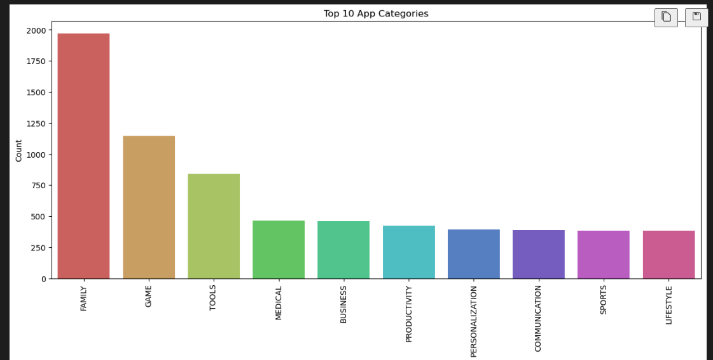
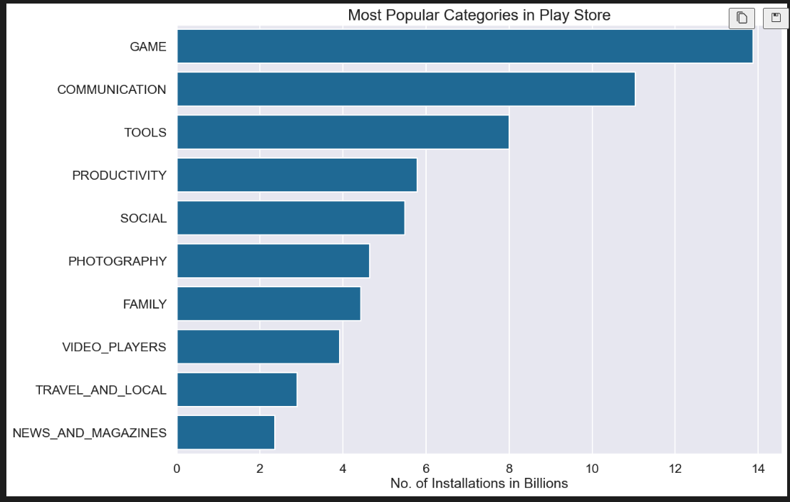
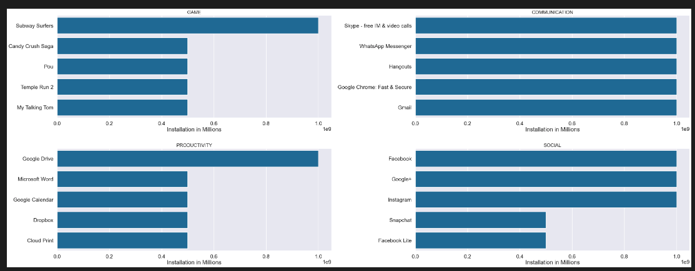

## Google Play Store Analysis
This project performs Exploratory Data Analysis (EDA) and Feature Engineering (FE) on the Google Play Store dataset to uncover trends, patterns, and insights about apps, their categories, installations, ratings, and user preferences.
## Project Structure
📁  Google_PlayStore_Analysis
├── EDA+And+FE+Google+Playstore.ipynb   # Main Jupyter Notebook with EDA & FE
├── requirements.txt                  # Dependencies
├── .gitignore                        # Ignored files
├── README.md                         # Project Documentation
└── dataset/                          # Dataset (add path if included)

## Objectives
Understand the distribution of numerical and categorical features.
Identify the most popular app categories.
Analyze installations, ratings, and reviews.
Perform feature engineering to extract insights from date/time columns.
Visualize patterns to support decision-making.

## Key Insights

## Univariate Analysis
Ratings are left-skewed, with most apps rated between 3.5 and 5.0.
Reviews, Size, Installs, and Price are highly right-skewed.
Most apps were last updated in 2018–2019.

## Categorical Features
Majority of apps are Free.
Most apps are rated suitable for Everyone.
Family and Game are the top two categories.

## Category Popularity
Family (19%) has the largest share of apps.
Game (10%) follows closely.
Categories like Beauty, Comics, Parenting have minimal representation.

## Installations
Game apps dominate with the highest installs (~35 billion).
Communication and Tools apps are also widely installed.
Subway Surfers, Instagram, Snapchat, Facebook Lite are among the most popular apps.

## Perfect Ratings
271 apps have a 5.0 perfect rating.
Most belong to Family and Education categories.

## Visualizations
Distribution plots of numerical features (Ratings, Reviews, Installs, etc.)
Count plots for categorical features (Type, Content Rating, Categories)
Pie charts and bar charts showing app category distribution & installs
Top installed apps across categories

##  Sample Visualizations

### App Category Distribution

### Installations by Category

### Top Installed Apps in Each Category

## Requirements
Install dependencies from requirements.txt:
pip install -r requirements.txt
Key Libraries:
pandas
numpy
matplotlib
seaborn
jupyter

## Observations
Most apps are free and targeted toward a general audience.
The Family and Game categories dominate in both number and installations.
Only a small subset of apps achieve a perfect rating.
Update frequency (2018–2019 surge) indicates app developers’ push to remain relevant.

## Future Work
Build predictive models to estimate app ratings or installations.
Apply clustering to group similar apps.
Explore NLP analysis on app descriptions and reviews.

## Author
Puneet Kumar
📧 Email: puneetrajpoot513@gmail.com

🌐 GitHub: Puneet1223
